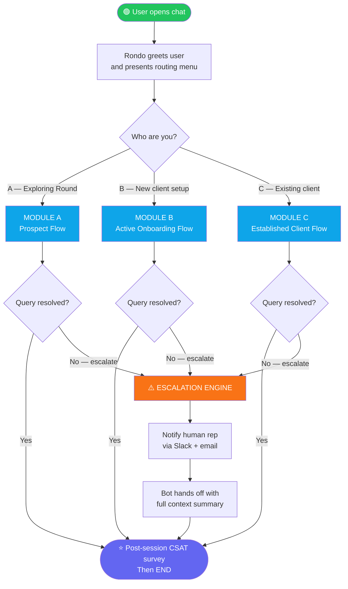
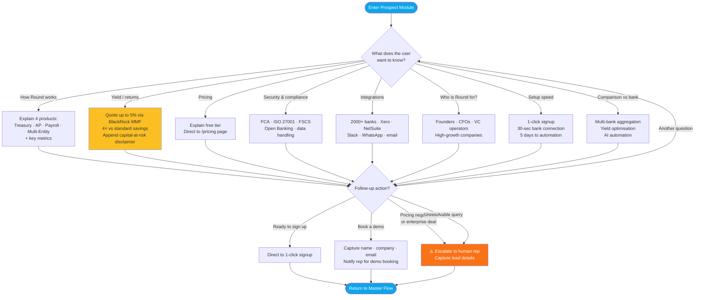
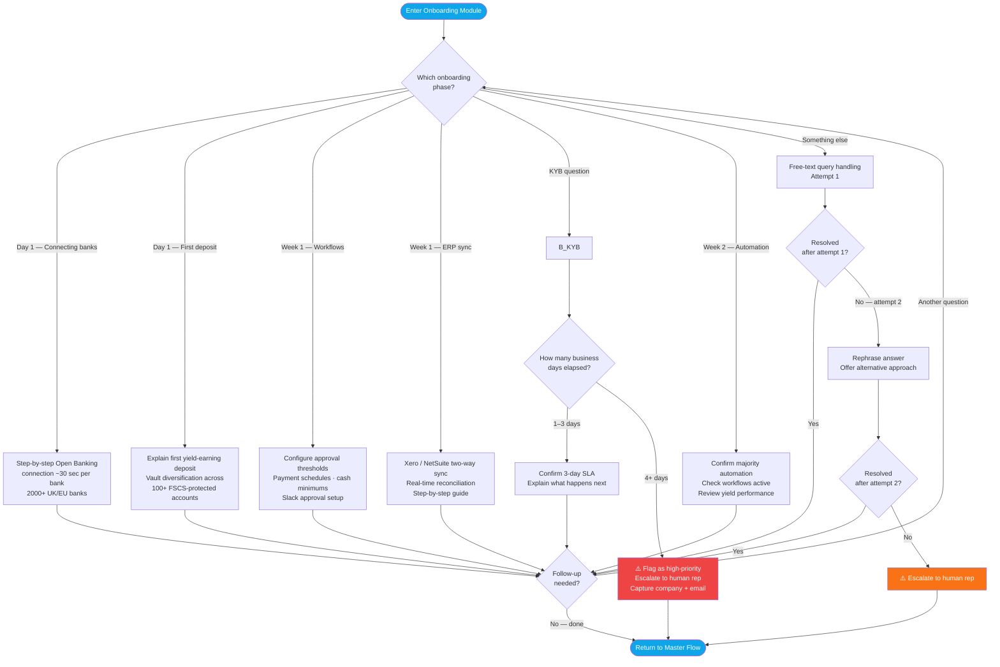
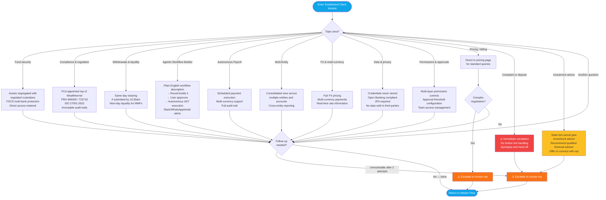
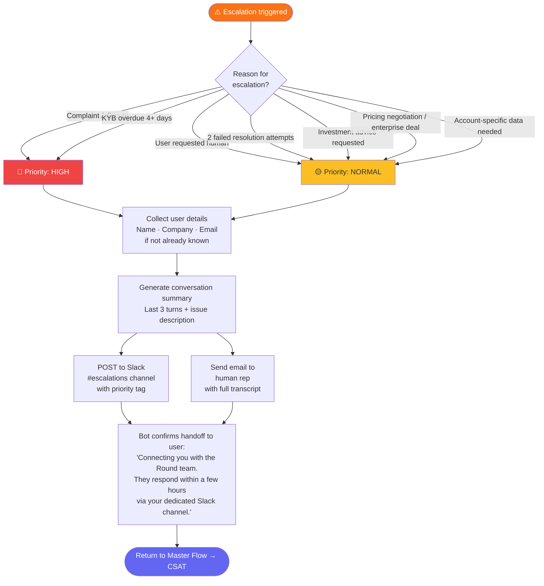
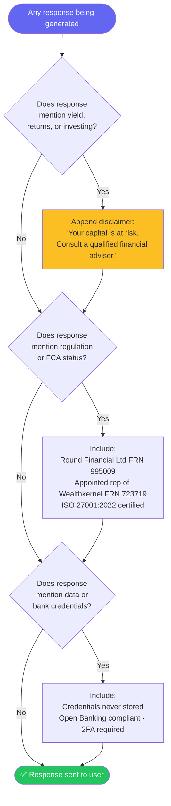
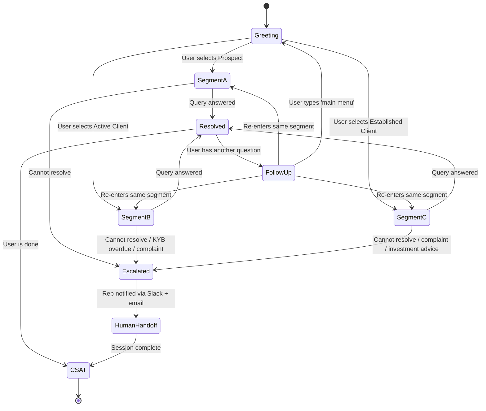

# Round Treasury — Rondo Chatbot: Flowchart Architecture

> Render with any Mermaid-compatible viewer (GitHub, VS Code Mermaid Preview, mermaid.live)

---

## Diagram 1 — Master Architecture (Top-Level Flow)

---

## Diagram 2 — Module A: Prospect Flow

---

## Diagram 3 — Module B: Active Onboarding Flow

---

## Diagram 4 — Module C: Established Client Flow

---

## Diagram 5 — Escalation Engine (Detailed)

---

## Diagram 6 — Compliance & Disclaimer Logic

---

## Diagram 7 — User Identification & Session State

---

*All diagrams use [Mermaid](https://mermaid.js.org/) syntax. Render at [mermaid.live](https://mermaid.live) or in VS Code with the Mermaid Preview extension.*
